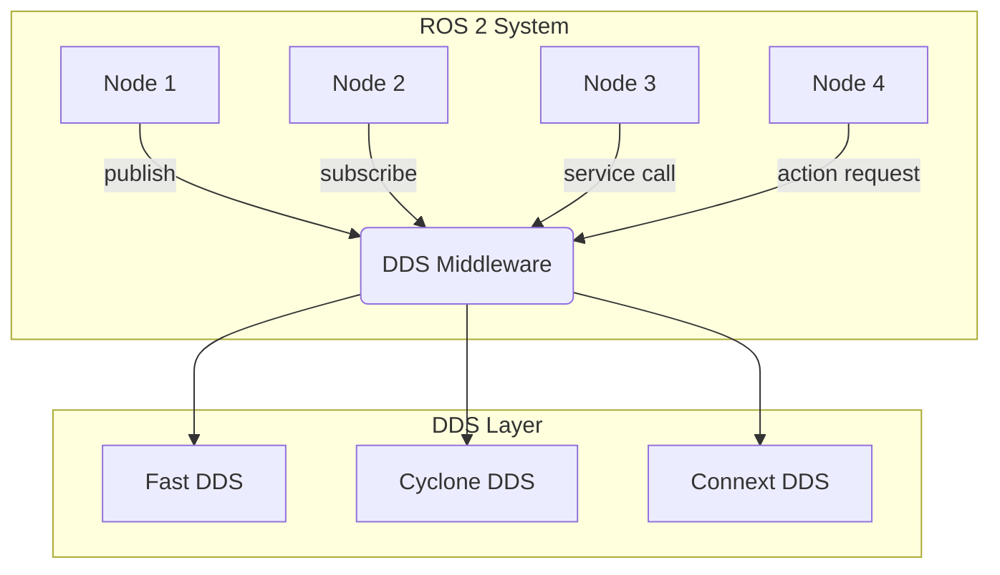

# ROS 2 Architecture and DDS Middleware

## Learning Objectives
- Understand the architecture of ROS 2 and its key components
- Learn about DDS (Data Distribution Service) middleware and its role in ROS 2
- Explore how ROS 2 differs from ROS 1 in terms of architecture

## Introduction to ROS 2

ROS 2 (Robot Operating System 2) is the next generation of the Robot Operating System. It addresses many of the limitations of ROS 1, particularly in areas of security, real-time support, and multi-robot systems.

### Key Improvements over ROS 1
- **Quality of Service (QoS) settings**: Allow for reliable communication over unreliable networks
- **Security**: Built-in security features for communication between nodes
- **Real-time support**: Better support for real-time applications
- **Multi-robot support**: Improved support for multi-robot systems
- **Cross-platform compatibility**: Better support for Windows and macOS in addition to Linux

## DDS Middleware

ROS 2 uses DDS (Data Distribution Service) as its underlying communication middleware. DDS is a vendor-neutral, open standard that provides a publish-subscribe communication model.

### What is DDS?

DDS is a middleware protocol and API standard for distributed, real-time, publish-subscribe communication. It provides:

- **Data-centricity**: Focus on data rather than communication endpoints
- **Automatic discovery**: Publishers and subscribers find each other automatically
- **Quality of Service (QoS)**: Configurable policies for reliability, durability, and other communication characteristics
- **Platform independence**: Works across different operating systems and programming languages

### DDS Implementations in ROS 2

ROS 2 can work with different DDS implementations:
- **Fast DDS** (formerly Fast RTPS) - Default in recent ROS 2 versions
- **Cyclone DDS** - Lightweight and efficient
- **RTI Connext DDS** - Commercial solution with enterprise features
- **OpenSplice DDS** - Open-source implementation

## ROS 2 Architecture Components

### Nodes
In ROS 2, a node is the fundamental unit of computation. Each node runs a specific task and communicates with other nodes through topics, services, and actions.

```python
import rclpy
from rclpy.node import Node

class MinimalPublisher(Node):

    def __init__(self):
        super().__init__('minimal_publisher')
        self.publisher_ = self.create_publisher(String, 'topic', 10)
        timer_period = 0.5  # seconds
        self.timer = self.create_timer(timer_period, self.timer_callback)
        self.i = 0

    def timer_callback(self):
        msg = String()
        msg.data = 'Hello World: %d' % self.i
        self.publisher_.publish(msg)
        self.get_logger().info('Publishing: "%s"' % msg.data)
        self.i += 1
```

### Topics
Topics are named buses over which nodes exchange messages. They follow a publish-subscribe communication pattern.

### Services
Services provide a request-response communication pattern, similar to a function call.

### Actions
Actions are for long-running tasks that may send feedback during execution and provide status updates.

## Quality of Service (QoS) in ROS 2

QoS profiles allow you to configure communication behavior for different scenarios:

- **Reliability**: Whether messages should be reliably delivered
- **Durability**: Whether late-joining subscribers should receive old messages
- **History**: How many messages to store for late-joining subscribers
- **Liveliness**: How to detect if a publisher is still active

Example of setting QoS:
```python
from rclpy.qos import QoSProfile

qos_profile = QoSProfile(depth=10)
qos_profile.reliability = ReliabilityPolicy.RELIABLE
qos_profile.durability = DurabilityPolicy.TRANSIENT_LOCAL
```

## Architecture Diagram



## Summary

ROS 2's architecture with DDS middleware provides a robust foundation for building distributed robotic applications. The use of DDS brings enterprise-grade communication features to robotics, enabling more reliable and scalable robot systems.

## Key Takeaways
- ROS 2 uses DDS as its communication middleware
- DDS provides publish-subscribe communication with QoS controls
- ROS 2 addresses limitations of ROS 1 with improved security, real-time support, and multi-robot capabilities
- QoS settings allow customization of communication behavior for different use cases